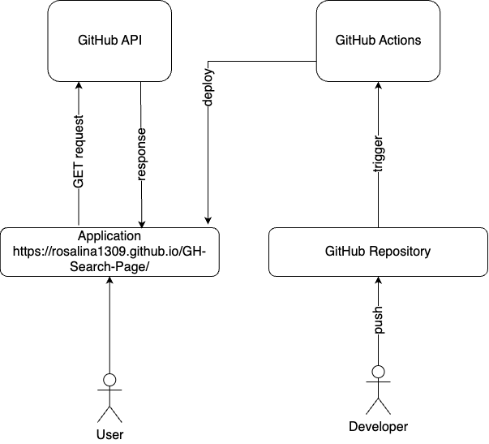

# GitHub Search Page


## Introduction

Hi, I'm Rosie. and welcome to my GitHub Search Page where you can find an user's Github account by their name, see all of their repositories and even be able to search for a specific one by its name or the language you are interested in.

This React App is written with Typescript, Vanilla CSS and I ultilized the GitHub API([officical docs here](https://docs.github.com/en/rest/overview/endpoints-available-for-github-app-installation-access-tokens?apiVersion=2022-11-28)).

I divided the components and tried to implement the seperate of concern pattern, which is a design principle that manages complexity by partitioning the software system so that each partition is responsible for a separate concern, minimizing the overlap of concerns as much as possible.

## Architectural Overview



## Considerations

- This is a MVP and implementation time is limited
- It should have a responsive interface using React with Typescript and ultilize [Laws of UX](https://lawsofux.com/) best practices.
- Authentication and availability (dependency on GitHub API's availability) are not considered.

Therefore, although there are many other functionalities came into my mind, I decided that this will fit with a Frontend Application using React and Typescript. For deployment I used GitHub Pages because it's easy to use and has an extensive ecosystem. Moreover, it requires less effort on domain name, hosting and HTTPS configuration.

## How to run the app locally

If you want to run the app locally please run the commands on the terminal in the root folder
 
```bash
cd search-page
npm install
npm start
```

## How to run the test suite

If you want to run the app locally please run the commands on the terminal in the root folder
 
```bash
cd search-page
npm t
```

## How to deploy

The newest version of my application is always available at [GH-Search-Page](https://rosalina1309.github.io/GH-Search-Page/)

There are two ways to deploy the app:

### Using CI/CD pipeline

- I have developed a CI/CD pipeline on GitHub Actions, which will run the test suite and deploy the newest version of the app everytime a commit is pushed. 
- You can see the proccess of deploying the app on GitHub Actions as it will take a while to run and deploy.
  
### Deploy from your local machine

Please run these commands on the terminal in the root folder

```bash
cd search-page
npm run deploy
```

## Future improvements

- Using Storybook to impove UI Development
- Creating a Backend for the app:
  - Authentication (see privte repos if the user has permission)
  - Caching (avoid depend on GitHub in case GitHub is down)
  - Abstract the implementation from the user by using Backend.
